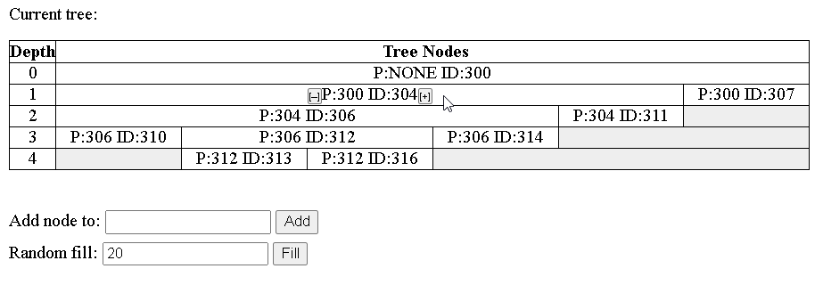

# Tree manager

### Server
The server is written in Python and uses MySQL to store data.

Dependencies:
* Flask
* Flask-Compress
* Flask-RESTful
* mysql-connector-python

To start server with Flask, run
~~~
python -m flask --app server/app.py run
~~~

MySQL connection parameters are obtained from the following environment variables:

| Variable                       | Example       |
|--------------------------------|---------------|
| TREEMANAGER_DB_HOST            | _localhost_   |
| TREEMANAGER_DB_PORT | _3306_        |
| TREEMANAGER_DB_USER            | _tmuser_      |
| TREEMANAGER_DB_PASSWORD        | _fjdsH7sd8_   |
| TREEMANAGER_DB_NAME            | _treemanager_ |

The user and the empty database must be created manually. The user must have rights to alter the database schema.

The database schema needed to run the server is created by the server automatically, on the first run.

The project contains files needed to run the server at Heroku with Gunicorn and Nginx:
~~~
Procfile
requirements.txt
runtime.txt
config/nginx.conf.erb 
~~~

### Client

The client is an HTML/JavaScript SPA. The static content is deployed alongside with the server and by default delivered to the user's browser via Flask.
